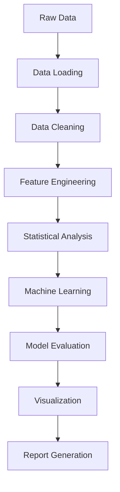

# 🩸 Menstrual Health Analysis Dashboard

[](https://python.org)
[](https://streamlit.io)
[](https://github.com)

## 📋 Overview

This project presents a comprehensive analysis of menstrual health data using advanced statistical methods and machine learning techniques. The study examines the relationship between menstrual period heaviness and symptom severity in a dataset of 271 participants.

## 🎯 Key Findings

### Model Performance
- **Accuracy**: 85.4%
- **ROC AUC**: 0.450
- **Dataset**: 271 participants, 19 symptom features
- **Class Distribution**: 11.1% heavy periods, 88.9% non-heavy periods

### Top Risk Factors
1. **Difficulty in Sleeping** (OR = 1.767) - Increases Risk
2. **Weight Gain** (OR = 1.720) - Increases Risk  
3. **Mood Swings** (OR = 1.311) - Increases Risk
4. **Depression** (OR = 1.230) - Increases Risk
5. **Restlessness** (OR = 1.230) - Increases Risk

### Protective Factors
1. **Swollen Extremities** (OR = 0.525) - Decreases Risk
2. **Nervousness** (OR = 0.599) - Decreases Risk
3. **Confusion** (OR = 0.607) - Decreases Risk

## 🚀 Quick Start

### Windows Users (Easiest)
```bash
# Simply double-click the batch file
run_analysis.bat
```

### Manual Installation
```bash
# Install dependencies
pip install -r requirements.txt

# Run the application
streamlit run streamlit_app.py
```

## 📖 Usage Guide

The Streamlit dashboard provides five main sections:

1. **📈 Overview**: Dataset summary and demographics
2. **🤖 Logistic Regression**: Model performance and feature importance
3. **📊 Symptom Analysis**: Interactive symptom comparison
4. **🔍 Interactive Explorer**: Demographics and correlation analysis
5. **📋 Reports**: Comprehensive summaries and downloads

## 📁 Project Structure

```
menstrual-health-analysis/
├── 📊 data/DATA SHEET.xlsx          # Primary dataset
├── 📈 figures/                      # Generated visualizations
├── 📋 reports/                      # Analysis reports
├── 🐍 scripts/                      # Analysis scripts
├── 🌐 streamlit_app.py              # Main dashboard
├── 🪟 run_analysis.bat              # Windows batch file
├── 📦 requirements.txt              # Dependencies
└── 📖 README.md                     # This file
```

## 🏗️ Technical Architecture

### Data Processing Pipeline



### Technology Stack
- **Data Processing**: pandas, numpy
- **Machine Learning**: scikit-learn
- **Visualization**: plotly, matplotlib, seaborn
- **Web Interface**: Streamlit
- **Statistical Analysis**: scipy

## 📊 Clinical Implications

### Risk Assessment
- **Screening Tool**: Use identified risk factors for early identification
- **Risk Stratification**: Categorize patients based on symptom profiles
- **Preventive Care**: Target high-risk individuals for intervention

### Treatment Planning
- **Integrated Approach**: Address sleep, weight, and mental health factors
- **Personalized Medicine**: Tailor treatments based on symptom patterns
- **Multidisciplinary Care**: Involve sleep specialists, nutritionists, and mental health professionals

## ⚠️ Limitations

1. **Model Performance**: ROC-AUC of 0.450 indicates poor discriminative ability
2. **Class Imbalance**: 11.1% vs 88.9% distribution affects performance
3. **Cross-sectional Design**: Cannot establish causal relationships
4. **Sample Size**: Limited heavy period cases (n=30)

## 🚀 Future Work

1. **Data Enhancement**: Longitudinal studies, larger sample size
2. **Methodological Improvements**: Advanced ML models, ensemble methods
3. **Clinical Applications**: Intervention studies, real-world validation

## 🤝 Contributing

We welcome contributions from researchers, clinicians, and data scientists.

### Development Setup
```bash
git clone <repository-url>
cd menstrual-health-analysis
pip install -r requirements.txt
```

## 📄 License

This project is licensed under the MIT License.

## 📞 Support

- **Documentation**: Check this README and the Streamlit guide
- **Issues**: Report bugs on GitHub Issues
- **Email**: Contact the research team for clinical questions

---

*Last updated: December 2024*