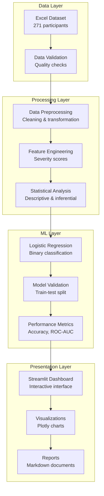
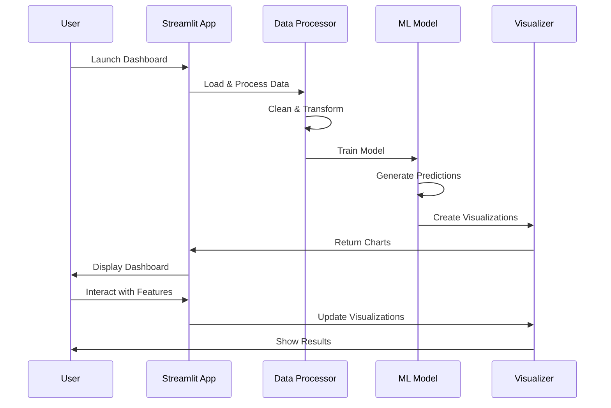
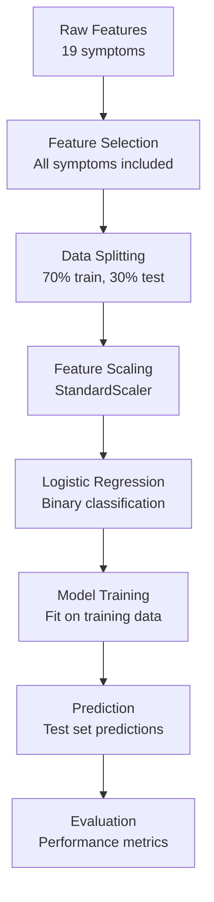

# 🔬 Technical Documentation: Menstrual Health Analysis

## 📋 Table of Contents

- [System Architecture](#system-architecture)
- [Data Processing Pipeline](#data-processing-pipeline)
- [Machine Learning Pipeline](#machine-learning-pipeline)
- [Statistical Analysis Methods](#statistical-analysis-methods)
- [Visualization Framework](#visualization-framework)
- [Performance Metrics](#performance-metrics)
- [Code Structure](#code-structure)
- [API Reference](#api-reference)
- [Deployment Guide](#deployment-guide)

## 🏗️ System Architecture

### High-Level Architecture



### Component Interaction



## 🔄 Data Processing Pipeline

### 1. Data Loading
```python
def load_data():
    """Load and preprocess the dataset"""
    df = pd.read_excel("data/DATA SHEET.xlsx", sheet_name=0)
    return df
```

### 2. Data Cleaning
- **Missing Value Handling**: Fill missing values with 0 for severity scores
- **Data Type Conversion**: Convert categorical variables to appropriate types
- **Outlier Detection**: Identify and handle extreme values
- **Data Validation**: Check for data consistency and integrity

### 3. Feature Engineering
```python
# Create binary target variable
df['is_heavy_period'] = (df[period_heaviness_col] == 'Heavy').astype(int)

# Standardize severity scores
severity_features = []
for symptom_key, severity_col in severity_mapping.items():
    if severity_col in df.columns:
        severity_features.append(df[severity_col].fillna(0).values)
```

### 4. Data Transformation
- **Scaling**: StandardScaler for logistic regression
- **Encoding**: Binary encoding for categorical variables
- **Normalization**: Min-max scaling for visualization

## 🤖 Machine Learning Pipeline

### Model Architecture



### Model Configuration
```python
# Logistic Regression Parameters
lr_model = LogisticRegression(
    random_state=42,
    max_iter=1000,
    solver='lbfgs'
)

# Data Splitting
X_train, X_test, y_train, y_test = train_test_split(
    X, y, 
    test_size=0.3, 
    random_state=42, 
    stratify=y
)
```

### Feature Importance Calculation
```python
# Get coefficients
coefficients = lr_model.coef_[0]

# Calculate feature importance
feature_importance = pd.DataFrame({
    'Feature': feature_names,
    'Coefficient': coefficients,
    'Abs_Coefficient': np.abs(coefficients),
    'Odds_Ratio': np.exp(coefficients)
}).sort_values('Abs_Coefficient', ascending=False)
```

## 📊 Statistical Analysis Methods

### 1. Descriptive Statistics
- **Central Tendency**: Mean, median, mode
- **Variability**: Standard deviation, range, IQR
- **Distribution**: Skewness, kurtosis
- **Frequency**: Counts and percentages

### 2. Inferential Statistics

#### Chi-Square Tests
```python
def chi_square_test(symptom1, symptom2):
    """Perform chi-square test between two symptoms"""
    contingency_table = pd.crosstab(
        df[symptom1].fillna('Missing'), 
        df[symptom2].fillna('Missing')
    )
    chi2_stat, p_value, dof, expected = chi2_contingency(contingency_table)
    return chi2_stat, p_value
```

#### Correlation Analysis
```python
def correlation_analysis(symptom, target):
    """Calculate correlation between symptom and target"""
    corr, p_val = stats.pearsonr(df[symptom], df[target])
    return corr, p_val
```

#### T-Tests
```python
def t_test_comparison(group1, group2):
    """Perform t-test between two groups"""
    t_stat, p_val = stats.ttest_ind(group1, group2)
    return t_stat, p_val
```

### 3. Effect Size Calculations
- **Cramér's V**: For categorical associations
- **Cohen's d**: For continuous variables
- **Odds Ratios**: For logistic regression coefficients

## 📈 Visualization Framework

### 1. Interactive Visualizations (Plotly)
```python
# ROC Curve
fig = go.Figure()
fig.add_trace(go.Scatter(
    x=fpr, y=tpr,
    mode='lines',
    name=f'ROC Curve (AUC = {roc_auc:.3f})'
))

# Feature Importance
fig = px.bar(
    feature_importance,
    x='Coefficient',
    y='Feature',
    orientation='h',
    color='Coefficient',
    color_continuous_scale='RdBu'
)
```

### 2. Static Visualizations (Matplotlib/Seaborn)
```python
# Box plots
plt.figure(figsize=(12, 8))
sns.boxplot(data=symptom_df, x='Symptom', y='Severity', hue='Period_Type')

# Correlation heatmap
sns.heatmap(correlation_matrix, annot=True, cmap='RdBu_r', center=0)
```

### 3. Dashboard Components
- **Metrics**: Key performance indicators
- **Charts**: Interactive plots with explanations
- **Tables**: Detailed data displays
- **Filters**: User-controlled data selection

## 📊 Performance Metrics

### 1. Classification Metrics
```python
# Accuracy
accuracy = accuracy_score(y_test, y_pred)

# Precision, Recall, F1-Score
precision = precision_score(y_test, y_pred)
recall = recall_score(y_test, y_pred)
f1 = f1_score(y_test, y_pred)

# ROC AUC
roc_auc = roc_auc_score(y_test, y_pred_proba)
```

### 2. Model Validation
```python
# Confusion Matrix
cm = confusion_matrix(y_test, y_pred)

# Classification Report
report = classification_report(y_test, y_pred, target_names=['Non-Heavy', 'Heavy'])
```

### 3. Statistical Significance
- **P-values**: Statistical significance testing
- **Confidence Intervals**: Parameter estimation
- **Effect Sizes**: Practical significance

## 🏗️ Code Structure

### Main Application (`streamlit_app.py`)
```python
# Core Functions
@st.cache_data
def load_data():
    """Load and cache dataset"""

@st.cache_data
def prepare_logistic_regression_data(df):
    """Prepare data for analysis"""

def create_logistic_regression_model(X, y, feature_names):
    """Create and train model"""

def main():
    """Main application function"""
```

### Analysis Scripts (`scripts/`)
```python
# logistic_regression_analysis.py
def logistic_regression_analysis(file_path):
    """Comprehensive logistic regression analysis"""

# severity_analysis.py
def severity_analysis(file_path):
    """Symptom severity analysis"""

# statistical_analysis.py
def statistical_analysis(file_path):
    """Statistical relationship analysis"""
```

### Utility Functions
```python
# Data processing utilities
def clean_data(df):
    """Clean and preprocess data"""

def create_features(df):
    """Create derived features"""

# Visualization utilities
def create_roc_curve(y_test, y_pred_proba):
    """Create ROC curve visualization"""

def create_feature_importance_plot(feature_importance):
    """Create feature importance visualization"""
```

## 📚 API Reference

### Data Loading Functions
```python
load_data() -> pd.DataFrame
    """Load dataset from Excel file"""
    
prepare_logistic_regression_data(df) -> Tuple[np.ndarray, np.ndarray, List[str], pd.DataFrame]
    """Prepare data for logistic regression"""
```

### Model Functions
```python
create_logistic_regression_model(X, y, feature_names) -> Dict
    """Create and train logistic regression model"""
    
evaluate_model(model, X_test, y_test) -> Dict
    """Evaluate model performance"""
```

### Visualization Functions
```python
create_roc_curve(y_test, y_pred_proba) -> go.Figure
    """Create ROC curve plot"""
    
create_feature_importance_plot(feature_importance) -> go.Figure
    """Create feature importance bar chart"""
```

### Statistical Functions
```python
chi_square_test(symptom1, symptom2) -> Tuple[float, float]
    """Perform chi-square test"""
    
correlation_analysis(symptom, target) -> Tuple[float, float]
    """Calculate correlation coefficient"""
```

## 🚀 Deployment Guide

### Local Deployment
```bash
# Install dependencies
pip install -r requirements.txt

# Run application
streamlit run streamlit_app.py
```

### Docker Deployment
```dockerfile
FROM python:3.9-slim

WORKDIR /app
COPY requirements.txt .
RUN pip install -r requirements.txt

COPY . .
EXPOSE 8501

CMD ["streamlit", "run", "streamlit_app.py", "--server.port=8501", "--server.address=0.0.0.0"]
```

### Cloud Deployment
```yaml
# docker-compose.yml
version: '3.8'
services:
  menstrual-analysis:
    build: .
    ports:
      - "8501:8501"
    volumes:
      - ./data:/app/data
    environment:
      - STREAMLIT_SERVER_PORT=8501
```

### Performance Optimization
- **Caching**: Use `@st.cache_data` for expensive operations
- **Lazy Loading**: Load data only when needed
- **Memory Management**: Clear unused variables
- **Parallel Processing**: Use multiprocessing for large datasets

## 🔧 Configuration

### Environment Variables
```bash
# Streamlit Configuration
STREAMLIT_SERVER_PORT=8501
STREAMLIT_SERVER_ADDRESS=localhost
STREAMLIT_THEME_BASE=light

# Data Configuration
DATA_PATH=data/DATA SHEET.xlsx
CACHE_DIR=.cache
```

### Model Parameters
```python
# Logistic Regression Configuration
LOGISTIC_REGRESSION_CONFIG = {
    'random_state': 42,
    'max_iter': 1000,
    'solver': 'lbfgs',
    'test_size': 0.3,
    'stratify': True
}
```

## 📊 Monitoring & Logging

### Performance Monitoring
```python
import time
import logging

def monitor_performance(func):
    """Decorator to monitor function performance"""
    def wrapper(*args, **kwargs):
        start_time = time.time()
        result = func(*args, **kwargs)
        end_time = time.time()
        logging.info(f"{func.__name__} took {end_time - start_time:.2f} seconds")
        return result
    return wrapper
```

### Error Handling
```python
def safe_data_loading(file_path):
    """Safely load data with error handling"""
    try:
        df = pd.read_excel(file_path)
        return df
    except FileNotFoundError:
        st.error(f"Data file not found: {file_path}")
        return None
    except Exception as e:
        st.error(f"Error loading data: {e}")
        return None
```

---

*This technical documentation provides comprehensive information about the system architecture, implementation details, and deployment procedures for the Menstrual Health Analysis Dashboard.*
